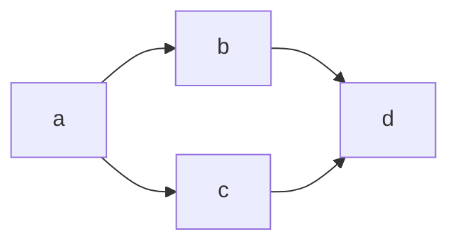
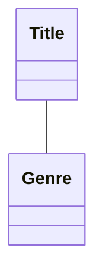
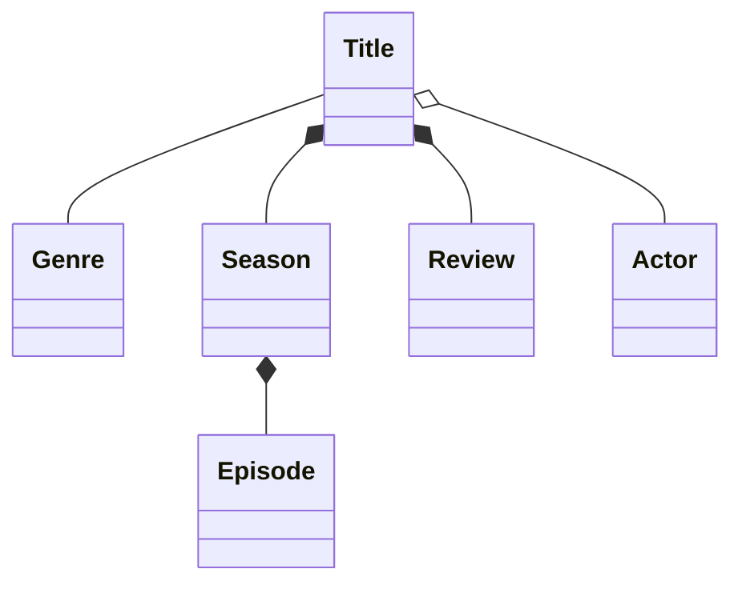

# Practise Mermaid Diagrams

## Flowchart

- a simple flow chart

```mermaid
flowchart LR
a --> b & c --> d
```

- a alternate way for simple flowchart

```mermaid
flowchart LR
a --> b
a --> c
b --> d
c --> d
```

## Class

- a simple class diagram

```mermaid
classDiagram
Title -- Genre
```

- a class diagram with different associations

```mermaid
classDiagram
Title -- Genre
Title *-- Season
Title *-- Review
Title o-- Actor

Season *-- Episode
```
