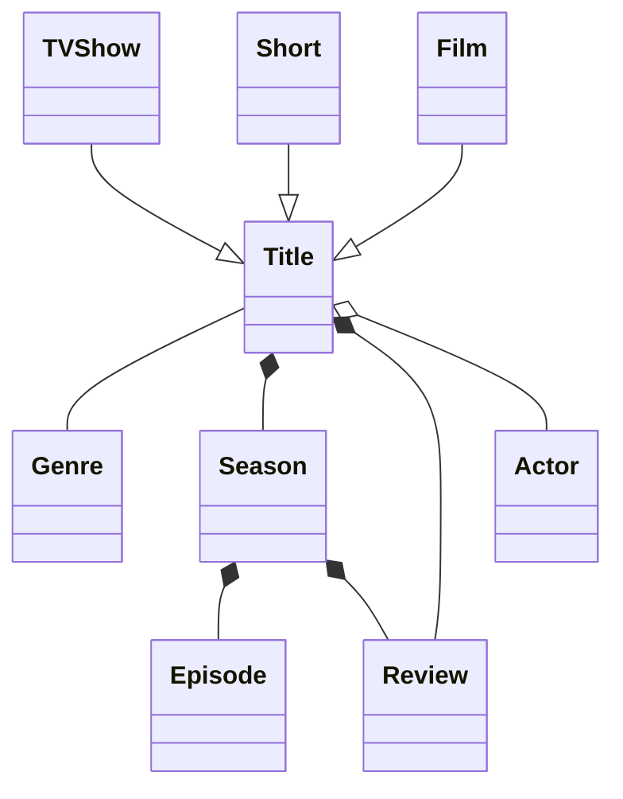
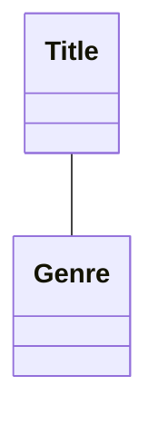
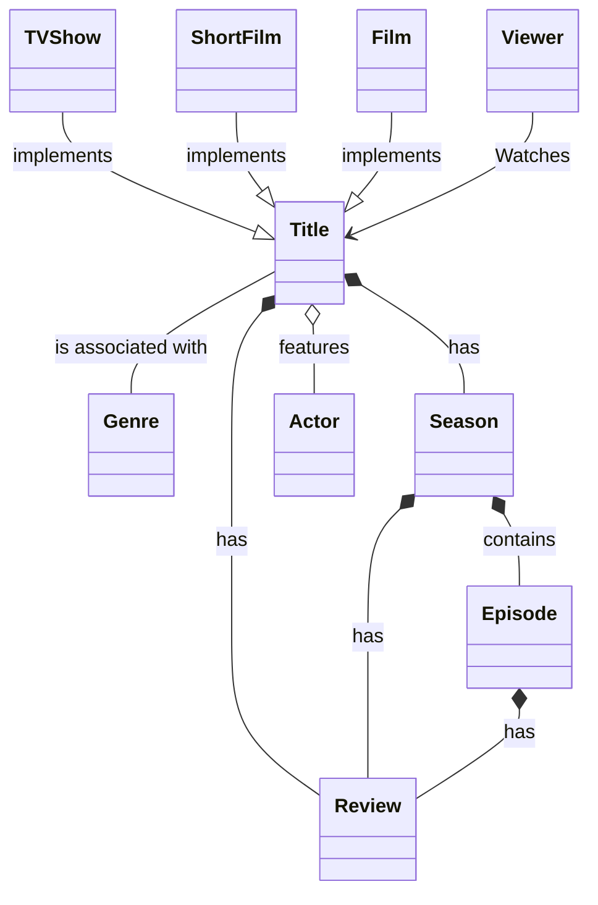
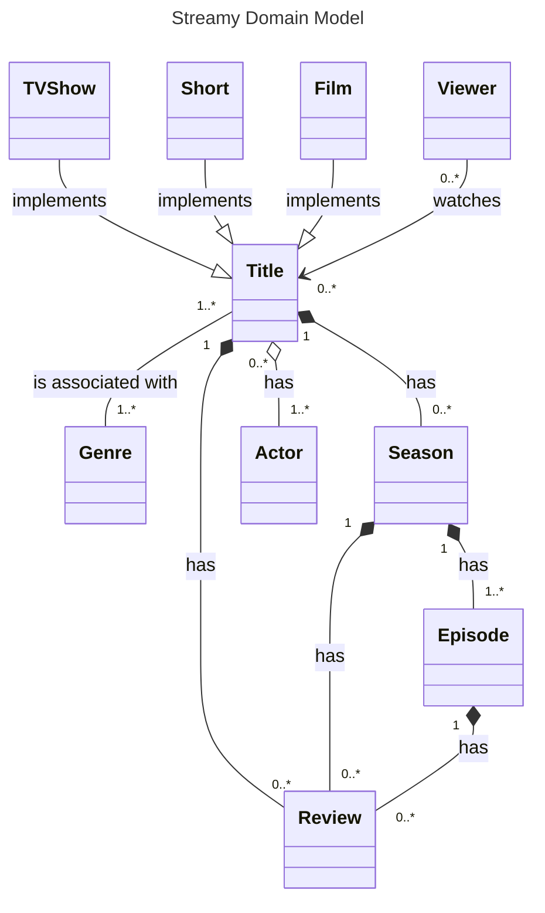

# Ch02: Enhance Your Domain Model

- mermaid with inheritance

```mermaid
classDiagram
    Title -- Genre
    Title *-- Season
    Title *-- Review
    Title o-- Actor

    TV Show --|> Title
    Short --|> Title
    Film --|> Title

    Season *-- Episode
    Season *-- Review
```

- mermaid with a comment

```mermaid
classDiagram
    Title -- Genre
    %%Title o-- Actor
```

- mermaid with descriptions

```mermaid
classDiagram
    Title -- Genre: is associated with
    Title *-- Season: has
    Title *-- Review: has
    Title o-- Actor: features

    TV Show --|> Title: implements
    Short Film --|> Title: implements
    Film --|> Title: implements

    Viewer --> Title: Watches

    Season *-- Review: has
    Season *-- Episode: contains

    Episode *-- Review: has
```

- mermaid w/ multiplicity

```mermaid
---
title: Streamy Domain Model
---

classDiagram
    Title "1..*" -- "1..*" Genre: is associated with

    Title "1" *-- "0..*" Season: has
    Title "1" *-- "0..*" Review: has
    Title "0..*" o--  "1..*" Actor: has

    TV Show --|> Title: implements
    Short --|> Title: implements
    Film --|> Title: implements

    Viewer "0..*" --> "0..*" Title: watches

    Season "1" *-- "0..*" Review: has
    Season "1" *-- "1..*" Episode: has

    Episode "1" *-- "0..*" Review: has
```
