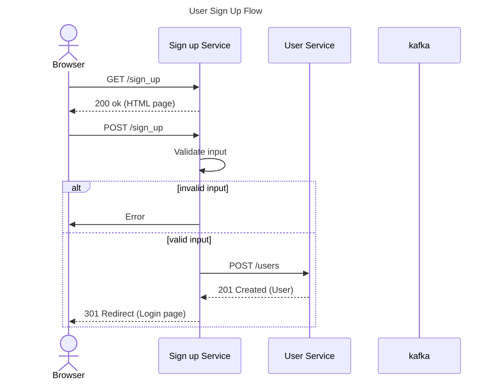

# Ch03: Visualize Application and User Flows

## Define Actors and participants

```mermaid
---
title: User Sign Up Flow
---

sequenceDiagram
    actor Browser
    participant SUS as Sign up Service
    participant User Service
    participant kafka

    Browser->>SUS: GET /sign_up
    SUS-->>Browser: 200 ok (HTML page)

    Browser->>SUS: POST /sign_up
    SUS->>SUS: Validate input

    alt invalid input
        SUS->>Browser: Error
    else valid input
        SUS->>User Service: POST /users
        User Service-->>SUS: 201 Created (User)
        SUS-->>Browser: 301 Redirect (Login page)
    end
```

